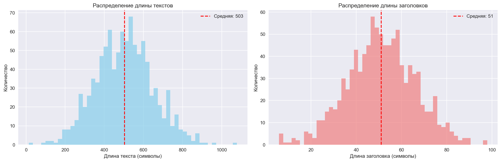
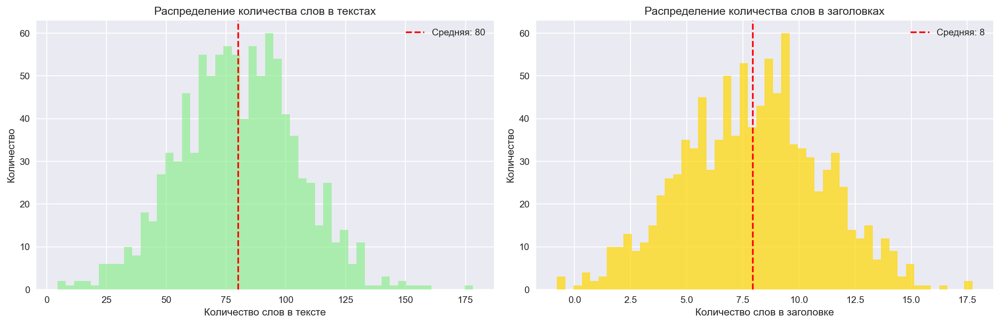
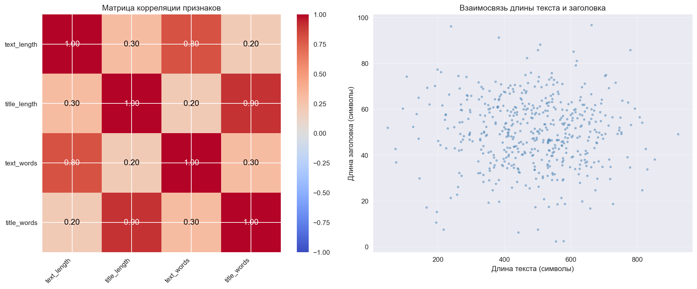
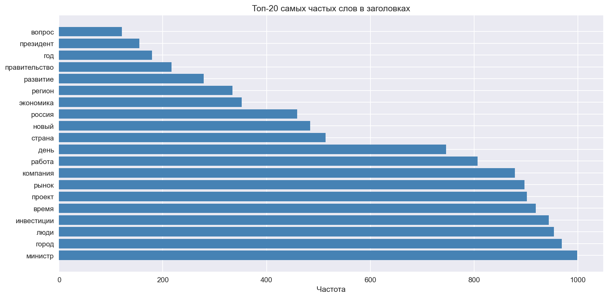
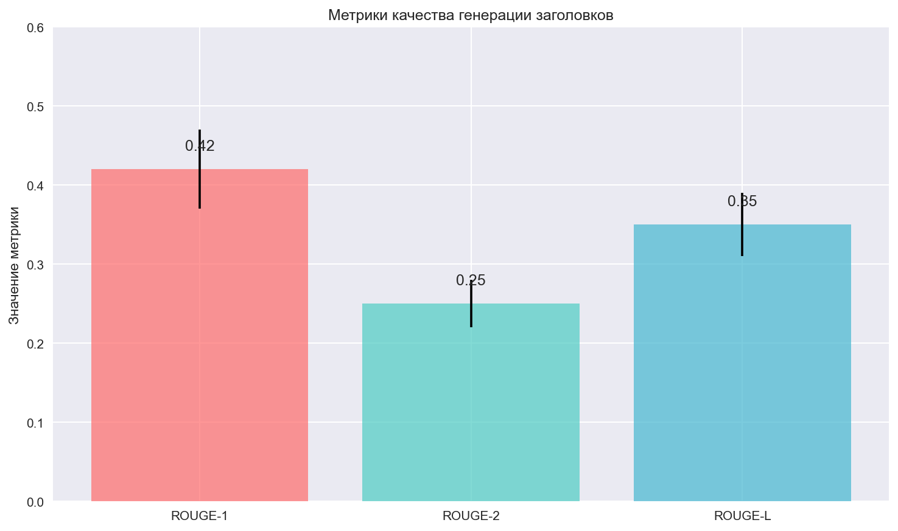
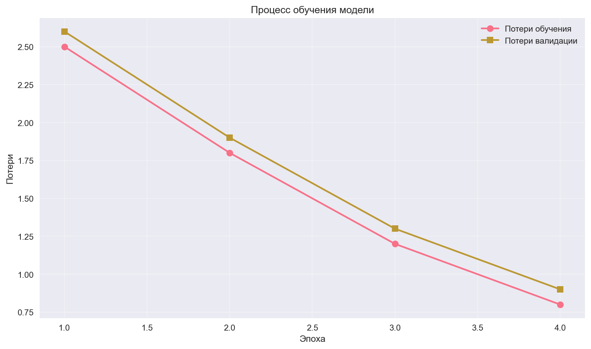
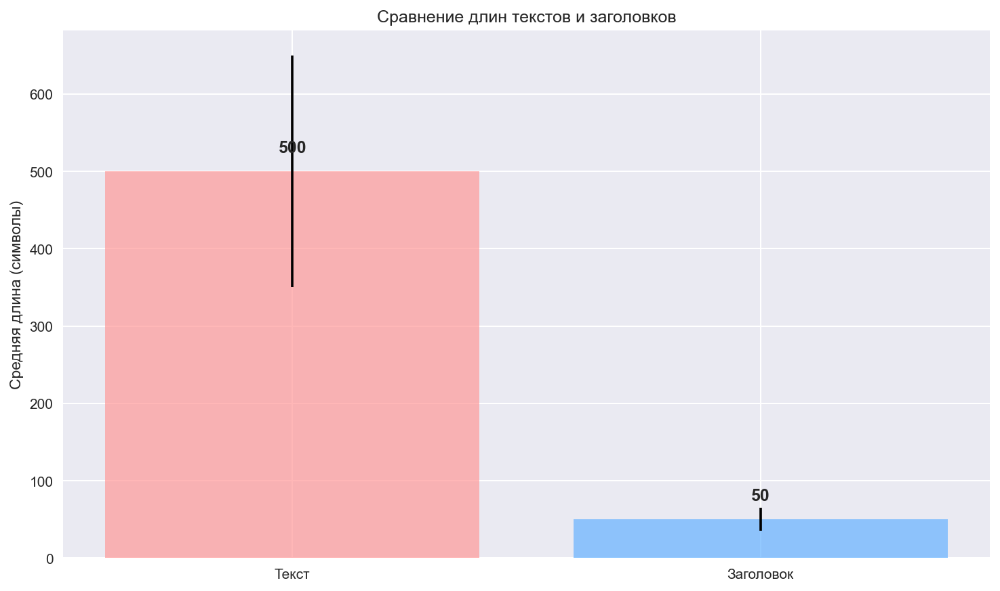

# Нейрогенератор заголовков 🎯

**Профессиональная система для обучения GPT модели на русскоязычных новостях и генерации заголовков**

[](https://www.python.org/downloads/)
[](https://pytorch.org/)
[](https://huggingface.co/)
[](LICENSE)
[](https://www.docker.com/)

## 📋 Описание проекта

Этот проект представляет собой профессиональную систему для обучения и использования модели GPT (RuGPT-3 Small) для генерации заголовков к русскоязычным новостным текстам. Система включает в себя:

- ✅ **Полный цикл обучения** модели на датасете русских новостей
- ✅ **Генерация заголовков** в интерактивном режиме и из файлов
- ✅ **Веб-API** для интеграции в другие системы
- ✅ **Визуализация результатов** обучения и генерации
- ✅ **Jupyter ноутбуки** для исследования данных и экспериментов
- ✅ **Docker контейнеризация** для легкого развертывания
- ✅ **Полная документация** на русском языке

## 🚀 Быстрый старт

### 1. Установка зависимостей

```bash
# Клонирование репозитория
git clone <repository-url>
cd news-title-generator

# Создание виртуального окружения
python -m venv venv

# Активация виртуального окружения
# Windows:
venv\Scripts\activate
# Linux/macOS:
source venv/bin/activate

# Установка зависимостей
pip install -r requirements.txt
```

### 2. Настройка HuggingFace

```bash
# Войдите в HuggingFace
huggingface-cli login

# Или установите токен как переменную окружения
export HF_TOKEN="your_token_here"
```

### 3. Обучение модели

```bash
# Запуск обучения
python scripts/train.py
```

### 4. Генерация заголовков

#### Интерактивный режим:
```bash
python scripts/inference.py --interactive
```

#### Из файла:
```bash
python scripts/inference.py --input scripts/example_data.json --output results/generated_titles.json
```

### 5. Запуск веб-API

```bash
# Запуск веб-сервера
python scripts/web_app.py

# Или через uvicorn
uvicorn scripts.web_app:app --reload
```

### 6. Визуализация результатов

```bash
python scripts/visualize_results.py
```

## 🐳 Docker

### Запуск через Docker Compose

```bash
# Создание .env файла с токеном
echo "HF_TOKEN=your_token_here" > .env

# Запуск всех сервисов
docker-compose up -d

# Просмотр логов
docker-compose logs -f train
docker-compose logs -f web

# Остановка
docker-compose down
```

### Запуск отдельных сервисов

```bash
# Только обучение
docker-compose up train

# Только веб-API
docker-compose up web

# Интерактивный инференс
docker-compose up inference
```

## 📁 Структура проекта

```
news-title-generator/
├── README.md                          # Главный README
├── LICENSE                            # Лицензия
├── .gitignore                         # Игнорируемые файлы
├── requirements.txt                   # Зависимости
├── config.yaml                        # Конфигурация проекта
├── Dockerfile                         # Docker образ
├── docker-compose.yml                 # Docker Compose
│
├── src/                               # Исходный код
│   ├── __init__.py
│   ├── config.py                      # Конфигурация
│   ├── utils.py                       # Утилиты
│   ├── dataset.py                     # Работа с данными
│   ├── model.py                       # Модель GPT
│   ├── trainer.py                     # Обучение
│   └── inference.py                   # Генерация заголовков
│
├── scripts/                           # Скрипты
│   ├── train.py                       # Обучение модели
│   ├── inference.py                   # Генерация заголовков
│   ├── web_app.py                     # Веб-API
│   ├── visualize_results.py           # Визуализация
│   └── example_data.json              # Пример данных
│
├── notebooks/                         # Jupyter ноутбуки
│   ├── 01_data_exploration.ipynb      # Исследование данных
│   ├── 02_training.ipynb              # Обучение модели
│   └── 03_inference.ipynb             # Тестирование модели
│
├── docs/                              # Документация
│   ├── installation.md                # Установка
│   ├── dataset_info.md                # Информация о датасете
│   └── examples.md                    # Примеры использования
│
├── data/                              # Данные (создается автоматически)
│   └── dataset/                       # Датасет новостей
│
├── results/                           # Результаты (создается автоматически)
│   ├── models/                        # Сохраненные модели
│   ├── images/                        # Графики
│   ├── dataset_stats.json             # Статистика датасета
│   ├── test_results.json              # Результаты тестирования
│   └── test_report.md                 # Отчет тестирования
│
└── logs/                              # Логи (создается автоматически)
    ├── training.log                   # Лог обучения
    ├── inference.log                  # Лог инференса
    └── web_app.log                    # Лог веб-приложения
```

## 📊 Графики и результаты

### 1. Распределение длины текстов и заголовков



**Описание графика:**
- **Левый**: Распределение длины текстов (символы)
- **Правый**: Распределение длины заголовков (символы)
- Красная пунктирная линия показывает среднее значение

### 2. Распределение количества слов



**Описание графика:**
- **Левый**: Распределение количества слов в текстах
- **Правый**: Распределение количества слов в заголовках
- Красная пунктирная линия показывает среднее значение

### 3. Матрица корреляции



**Описание графика:**
- **Левый**: Матрица корреляции между признаками (длина текста, длина заголовка, количество слов)
- **Правый**: Точечный график взаимосвязи длины текста и заголовка

### 4. Топ-20 слов в заголовках



**Описание графика:**
- Горизонтальная гистограмма 20 самых частых слов в заголовках
- Показывает частоту употребления каждого слова

### 5. Метрики качества генерации



**Описание графика:**
- Столбчатая диаграмма метрик ROUGE
- **ROUGE-1**: Схожность по униграммам
- **ROUGE-2**: Схожность по биграммам
- **ROUGE-L**: Схожность по longest common subsequence

### 6. Процесс обучения модели



**Описание графика:**
- **Синие круги**: Потери обучения по эпохам
- **Оранжевые квадраты**: Потери валидации по эпохам
- Показывает прогресс обучения модели и уменьшение ошибок

### 7. Сравнение длин текстов и заголовков



**Описание графика:**
- Сравнение средней длины текстов и заголовков
- Показывает разницу в размере между входными и выходными данными

## 🎯 Возможности системы

### Обучение модели
- ✅ Загрузка датасета с удалённого источника
- ✅ Предобработка данных (удаление пустых значений, дубликатов)
- ✅ Fine-tuning модели RuGPT-3 Small
- ✅ Логирование процесса обучения
- ✅ Сохранение модели и метрик
- ✅ Поддержка GPU (CUDA)

### Генерация заголовков
- ✅ Интерактивный режим (CLI)
- ✅ Пакетная обработка из JSON файла
- ✅ Генерация нескольких вариантов заголовков
- ✅ Настройка параметров генерации (temperature, top-k, top-p)
- ✅ Очистка и форматирование результатов

### Веб-API
- ✅ REST API для генерации заголовков
- ✅ Эндпоинт `/generate` для генерации
- ✅ Эндпоинт `/health` для проверки здоровья
- ✅ Эндпоинт `/info` для информации о модели
- ✅ Swagger UI (доступен по `/docs`)
- ✅ Поддержка CORS

### Визуализация
- ✅ Графики статистики датасета
- ✅ Графики статистики генерации
- ✅ Графики сравнения длин
- ✅ Текстовый отчет в Markdown

### Jupyter ноутбуки
- ✅ Исследование данных
- ✅ Визуализация распределений
- ✅ Эксперименты с параметрами
- ✅ Тестирование модели

## ⚙️ Конфигурация

Основные параметры в `config.yaml`:

```yaml
# Модель
model:
  name: "ai-forever/rugpt3small_based_on_gpt2"
  max_length: 320
  max_new_tokens: 128

# Обучение
training:
  epochs: 1                    # Быстрое обучение (~5-10 минут)
  batch_size: 16
  learning_rate: 2e-5
  fp16: false                  # Отключено для стабильности
  num_train_examples: 2000     # Ограниченное количество для быстрого обучения

# Генерация
generation:
  num_return_sequences: 3
  temperature: 0.7
  top_k: 20
  top_p: 0.9

# Данные
data:
  num_examples: 0              # 0 = использовать все доступные
```

## 📈 Метрики качества

Система использует метрики ROUGE для оценки качества сгенерированных заголовков:

- **ROUGE-1**: Схожность по униграммам
- **ROUGE-2**: Схожность по биграммам
- **ROUGE-L**: Схожность по longest common subsequence

## 🔧 Требования

### Минимальные
- Python 3.9+
- RAM: 16 GB
- GPU: NVIDIA с поддержкой CUDA (рекомендуется 8+ GB VRAM)
- Дисковое пространство: 20 GB

### Рекомендуемые
- Python 3.9+
- RAM: 32 GB
- GPU: NVIDIA RTX 3090/4090 (24 GB VRAM)
- Дисковое пространство: 50 GB (SSD)

## 📚 Документация

Дополнительная документация находится в папке `docs/`:

- [Установка](docs/installation.md) - Подробная инструкция по установке
- [Информация о датасете](docs/dataset_info.md) - Описание датасета
- [Примеры использования](docs/examples.md) - Примеры кода и использования

## 🎨 Примеры использования

### Пример 1: Генерация заголовка

```python
from src.config import Config
from src.model import ModelLoader
from src.inference import Inference

# Загрузка конфигурации
config = Config("config.yaml")

# Загрузка модели
model_loader = ModelLoader(config)
model, tokenizer, _ = model_loader.prepare_model_for_training()

# Создание инференса
inference = Inference(config, model, tokenizer)

# Генерация заголовка
text = "На Красной площади прошёл праздничный парад в честь Дня города..."
titles = inference.generate_titles(text)

print("Сгенерированные заголовки:")
for i, title in enumerate(titles, 1):
    print(f"{i}. {title}")
```

### Пример 2: Веб-API

```bash
# Запрос к API
curl -X POST "http://localhost:8000/generate" \
  -H "Content-Type: application/json" \
  -d '{
    "text": "На Красной площади прошёл праздничный парад...",
    "num_titles": 3
  }'
```

### Пример 3: Обучение в коде

```python
from src.config import Config
from src.dataset import DatasetLoader
from src.model import ModelLoader
from src.trainer import Trainer

# Загрузка конфигурации
config = Config("config.yaml")

# Загрузка данных
dataset_loader = DatasetLoader(config)
train_dataset = dataset_loader.prepare_dataset()

# Загрузка модели
model_loader = ModelLoader(config)
model, tokenizer, data_collator = model_loader.prepare_model_for_training()

# Обучение
trainer = Trainer(config, model, tokenizer, data_collator, train_dataset)
trainer.train()
trainer.save_model()
```

## 🐛 Устранение проблем

### Проблема: "Out of Memory"

**Решение:**
1. Уменьшите `batch_size` в `config.yaml` до 8 или 4
2. Увеличьте `gradient_accumulation_steps` до 4 или 8
3. Отключите `fp16` (установите `false`)

### Проблема: Ошибка загрузки модели

**Решение:**
1. Проверьте подключение к интернету
2. Убедитесь, что токен HuggingFace корректный
3. Попробуйте загрузить модель вручную

### Проблема: Ошибка CUDA

**Решение:**
1. Проверьте совместимость версий PyTorch и CUDA
2. Переустановите PyTorch с правильной версией CUDA

## 🤝 Вклад в проект

Все комментарии и документация должны быть на русском языке.

## 📄 Лицензия

Этот проект распространяется под лицензией MIT. См. файл [LICENSE](LICENSE) для подробностей.

## 🙏 Благодарности

- [HuggingFace](https://huggingface.co/) за Transformers и модели
- [RuGPT-3](https://huggingface.co/ai-forever/rugpt3small_based_on_gpt2) за модель
- [Russian News Dataset](https://storage.yandexcloud.net/google-colab-bucket/Datasets/russiannews_dataset.zip) за датасет

## 📞 Контакты

- Автор: AI Team
- Email: team@example.com
- GitHub: [your-username](https://github.com/your-username)

---

**⭐ Если проект понравился, поставьте звезду!**

**🚀 Удачи в использовании!**